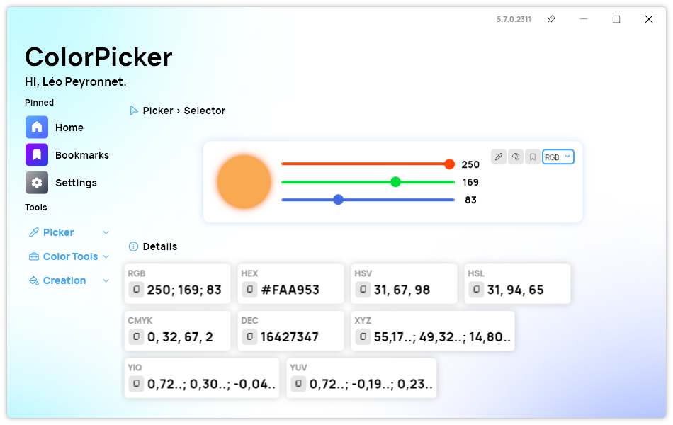
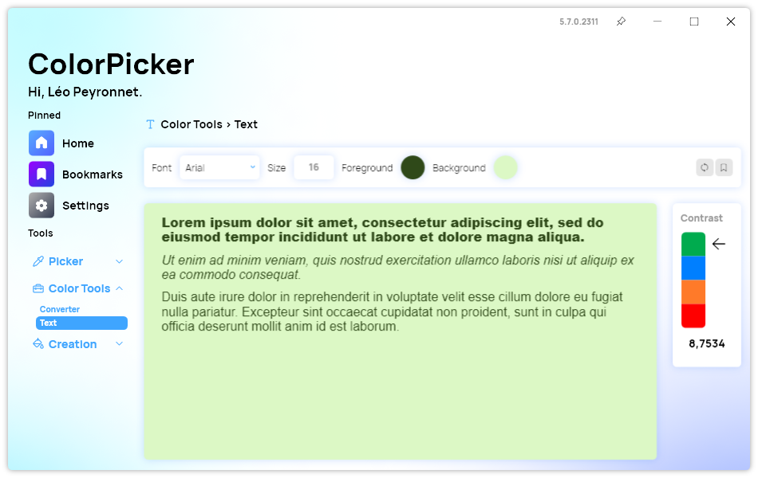
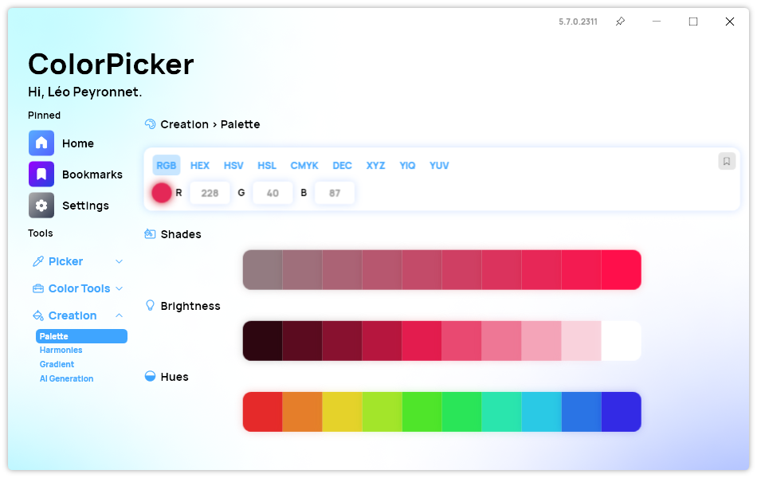
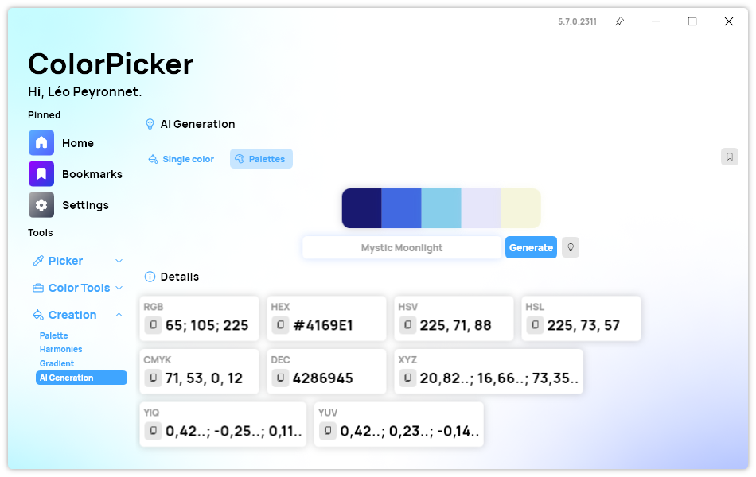

 

  

  <h1 align="center">ColorPicker</h1>

  

    ColorPicker Max is an app that enables you to pick, create and convert colors, preview text colors, generate color palettes and gradients, and more.
     
    <a href="https://tinyurl.com/DownloadColorPickerMax"><strong>Download »</strong></a>
     
    <a href="https://github.com/Leo-Corporation/ColorPicker/issues/new?assignees=&labels=bug&template=bug-report.yml&title=%5BBug%5D+">Report Bug</a>
    ·
    <a href="https://github.com/Leo-Corporation/ColorPicker/issues/new?assignees=&labels=enhancement&template=feature-request.yml&title=%5BEnhancement%5D+">Request Feature</a>
    ·
    <a href="https://github.com/Leo-Corporation/ColorPicker/issues?q=is%3Aopen+is%3Aissue+label%3Abug">Known Issues</a>

  

## What is it?

**ColorPicker Max** is a feature-rich and user-friendly color tool built for Windows using **.NET 8** and **WPF**. Whether you're a designer creating palettes or a developer working on UI contrast, ColorPicker Max simplifies every aspect of color manipulation.

You can select colors using a pixel picker, random generator, or sliders, and then explore a wide array of detailed color formats. With real-time conversion, gradient and palette generation, and intuitive tools for font and contrast checking, ColorPicker Max is a must-have for anyone working with colors.

## Download

### Setup

-   [Download Setup (Installer)](https://tinyurl.com/DownloadColorPickerMax)
-   [Changelog & Releases](https://github.com/Leo-Corporation/ColorPicker/releases)

### Portable

> ⚠ Some features (e.g., automatic updates) are not available in the portable version.

-   [Download Portable](https://www.mediafire.com/file/k4lvwqxtv1kmmvh/ColorPickerMaxPortable.exe/file)

## Features

### Color Selection and Management

<picture>
  <source srcset=".github/images/screens/1B.png" media="(prefers-color-scheme: dark)"          />
    
</picture>

ColorPicker Max offers three distinct methods for choosing colors: you can capture a hue directly from any pixel on your screen with the pixel picker tool, fine-tune precise values via adjustable RGB or HSL sliders, or instantly spark new ideas with the random color generator.

Once a color is selected, you’ll see its representation in RGB, HEX, HSL, HSV, CMYK, XYZ, YIQ, and YUV formats. Hover over any value to reveal a one-click copy button, making it effortless to transfer exact color codes into your projects.

Plus, you can convert any color between supported formats in real time. As you adjust one model (for example, HSL), all other fields update instantly, and you can preview the changes on an on-screen swatch before copying the converted value.

### Chromatic Wheel

An interactive chromatic wheel lets you visually explore color relationships. Multiple wheel styles are available so you can switch between classic hue‐saturation layouts or alternative presentations, ensuring you always find the perfect shade.

### Text Tool

<picture>
  <source srcset=".github/images/screens/6B.png" media="(prefers-color-scheme: dark)"          />
    
</picture>

Test typography and contrast in one place: choose foreground and background colors, pick a font and size, and immediately view the resulting text sample alongside its WCAG-compliant contrast ratio. This ensures your designs remain accessible and visually clear.

### Palette Generator

<picture>
  <source srcset=".github/images/screens/3B.png" media="(prefers-color-scheme: dark)"          />
    
</picture>

Build complete color schemes from a single base hue. ColorPicker Max generates coordinated palettes with variations in shades, tints, tones, and complementary hues. Save your custom palettes for future projects and quickly switch between them as needed.

### Gradient Creator

<picture>
  <source srcset=".github/images/screens/4B.png" media="(prefers-color-scheme: dark)"          />
    
</picture>

Design linear gradients by adjusting their positions, and setting the gradient angle. A live preview updates as you work, and you can export the final gradient directly as CSS code for seamless integration into your web designs.

### AI Color Suggestions

<picture>
  <source srcset=".github/images/screens/5B.png" media="(prefers-color-scheme: dark)"          />
    
</picture>

Leverage AI to generate color suggestions based on natural language prompts. Simply describe the color you envision, and the AI will provide a selection of colors that match your description. This feature is perfect for brainstorming sessions or when you're looking for inspiration.

### Bookmarks

Save individual colors, entire palettes, or gradients to your bookmarks library. Access your most important assets at any time from the dedicated bookmarks section, keeping your creative workflow organized and efficient.

### Customizable Settings

Tailor the application to your preferences by choosing between light and dark themes, selecting your language, defining the default color format, and configuring keyboard shortcuts. You can also specify which page opens at startup for immediate access to your favorite tool.

## Keyboard shortcuts

| Action                     | Shortcut           |
| -------------------------- | ------------------ |
| Start/Stop color selection | <kbd>Shift+S</kbd> |
| Copy selected screen color | <kbd>Shift+C</kbd> |

> You can modify or disable these shortcuts in the **Settings** page.

## Contribute

To build and contribute:

-   **Visual Studio 2022** (v17.0+)

    -   Workloads: **.NET Desktop Development**, **Git**

-   **.NET 8 SDK**
-   (_Optional_) **Inno Setup** v6.1+ for installer generation

👉 [See full contribution guide](https://github.com/Leo-Corporation/ColorPicker/blob/main/CONTRIBUTING.md)

## Branches

| Branch  | Description                  | Current version                                                                                         |
| ------- | ---------------------------- | ------------------------------------------------------------------------------------------------------- |
| `main`  | Stable release versions      |                   |
| `vNext` | Preview of upcoming features |  |

> Additional branches may exist for hotfixes or experiments.

## License

This project is licensed under the [MIT License](https://github.com/Leo-Corporation/ColorPicker/blob/main/LICENSE).

## Translation Credits

Huge thanks to our community translators:

-   🇮🇹 [@OCTIPI1](https://github.com/OCTIPI1) — Italian
-   🇨🇳 [@wcxu21](https://github.com/wcxu21) — Simplified Chinese
-   🇯🇵 [@coolvitto](https://github.com/coolvitto) — Japanese
